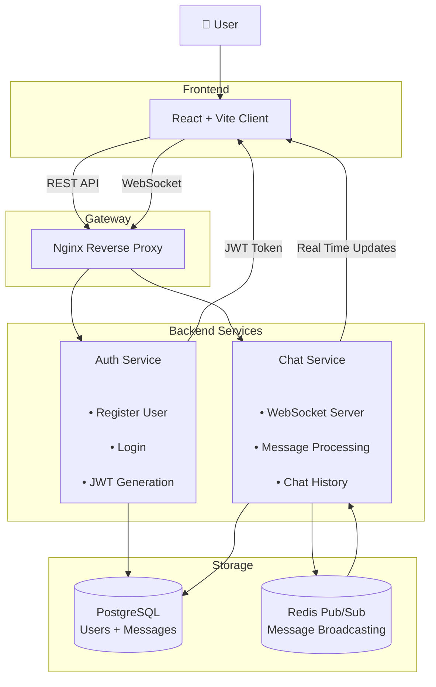
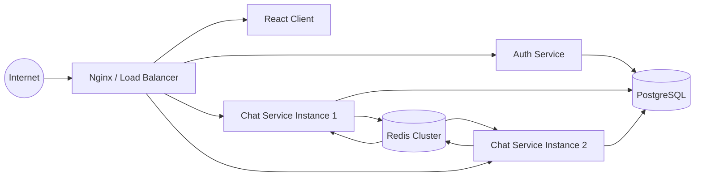

# 💬 ChatApp — Microservices Real-Time Chat Application

A lightweight **real-time chat application** built using a microservices architecture.

The system consists of independent backend services for authentication and messaging, along with a modern React-based frontend client.

## ✨ Features

* 🔐 JWT-based authentication
* 👤 User registration and login
* 💬 Real-time messaging using WebSockets
* 🗄️ Persistent message storage
* 🚀 Microservices architecture
* 🐳 Docker-based deployment
* 🔄 Redis support for message broadcasting
* 🌐 Nginx reverse proxy support
* 📈 Scalable architecture for multiple service instances

---

# 🏗️ System Architecture

The application follows a microservices architecture:

### Components

| Component         | Responsibility                                               |
| ----------------- | ------------------------------------------------------------ |
| `auth-service`    | User registration, login, JWT generation, authentication     |
| `chat-service`    | Real-time messaging, WebSocket handling, message persistence |
| `chat-app-client` | React + Vite frontend application                            |
| PostgreSQL        | Stores users and messages                                    |
| Redis             | Pub/Sub communication for scaling                            |
| Nginx             | Reverse proxy and gateway                                    |

---

# 🧩 High-Level System Design



---

# 🔐 Authentication Flow

The authentication flow uses JWT tokens.

```mermaid
sequenceDiagram

    participant User
    participant Client as React Client
    participant Gateway as Nginx
    participant Auth as Auth Service
    participant DB as PostgreSQL


    User->>Client: Enter credentials

    Client->>Gateway:
    POST /api/auth/login

    Gateway->>Auth:
    Forward Request

    Auth->>DB:
    Validate User

    DB-->>Auth:
    User Details

    Auth->>Auth:
    Generate JWT Token

    Auth-->>Client:
    Return JWT

    Client->>Client:
    Store Token

```

---

# 💬 Real-Time Messaging Flow

Messages are delivered using WebSockets.

```mermaid
sequenceDiagram

    participant Client as React Client
    participant Gateway as Nginx
    participant Chat as Chat Service
    participant DB as PostgreSQL
    participant Redis as Redis Pub/Sub
    participant Users as Connected Users


    Client->>Gateway:
    WebSocket Connection + JWT


    Gateway->>Chat:
    Forward Connection


    Client->>Chat:
    Send Message


    Chat->>DB:
    Save Message


    Chat->>Redis:
    Publish Event


    Redis->>Chat:
    Broadcast Event


    Chat->>Users:
    Push Message

```

---

# 📈 Production Deployment Design

The architecture supports horizontal scaling.



---

# 🛠️ Technology Stack

## Backend

* Java 17+
* Spring Boot
* Spring Security
* JWT Authentication
* Maven

## Frontend

* React
* Vite
* JavaScript / TypeScript

## Database

* PostgreSQL

## Messaging & Scaling

* Redis Pub/Sub
* WebSocket

## Deployment

* Docker
* Docker Compose
* Nginx

---

# 📋 Prerequisites

Install:

* Docker
* Docker Compose
* Java 17+
* Node.js 16+

---

# 🚀 Running the Application

## Using Docker Compose

Build and start all services:

```bash
docker-compose up --build
```

The application will start:

* React Client
* Auth Service
* Chat Service
* Database
* Redis
* Nginx

Open:

```
http://localhost:5173
```

---

# 💻 Local Development

## Frontend

```bash
cd chat-app-client

npm install

npm run dev
```

---

## Auth Service

```bash
cd auth-service

./mvnw spring-boot:run
```

---

## Chat Service

```bash
cd chat-service

./mvnw spring-boot:run
```

---

# ⚙️ Environment Configuration

Configure services using environment variables.

| Variable                     | Description                |
| ---------------------------- | -------------------------- |
| `SPRING_DATASOURCE_URL`      | Database connection URL    |
| `SPRING_DATASOURCE_USERNAME` | Database username          |
| `SPRING_DATASOURCE_PASSWORD` | Database password          |
| `JWT_SECRET`                 | Secret key for JWT signing |
| `REDIS_URL`                  | Redis connection URL       |

---

# 🔌 API Documentation

## Authentication Service

### Register User

```
POST /api/auth/register
```

Example:

```json
{
  "name": "John",
  "email": "john@example.com",
  "password": "password"
}
```

---

### Login

```
POST /api/auth/login
```

Response:

```json
{
  "token": "JWT_TOKEN"
}
```

---

### Current User

```
GET /api/users/me
```

Headers:

```
Authorization: Bearer <JWT_TOKEN>
```

---

# Chat Service

## Get Messages

```
GET /api/chats/{roomId}/messages
```

Requires JWT authentication.

---

## Send Message

```
POST /api/chats/{roomId}/messages
```

---

## WebSocket Endpoint

```
/ws
```

Used for:

* Sending messages
* Receiving real-time updates

---

# 🗂️ Project Structure

```
ChatApp/

├── auth-service/
│   ├── src/
│   └── pom.xml
│

├── chat-service/
│   ├── src/
│   └── pom.xml
│

├── chat-app-client/
│   ├── src/
│   └── package.json
│

├── docs/
│   └── system-design.md

├── docker-compose.yml

├── nginx.conf

└── README.md

```

---

# 🧪 Running Tests

## Auth Service

```bash
cd auth-service

./mvnw test
```

## Chat Service

```bash
cd chat-service

./mvnw test
```

---

# 🔒 Security Considerations

For production:

* Enable HTTPS
* Use secure JWT storage
* Rotate JWT secrets
* Add refresh tokens
* Enable API rate limiting
* Protect WebSocket endpoints
* Use database backups

---

# 🚀 Future Improvements

* Group conversations
* User presence tracking
* Typing indicators
* Message reactions
* File sharing
* Push notifications
* Kubernetes deployment
* CI/CD pipeline
* Monitoring with Prometheus and Grafana

---

# 📄 Documentation

Additional design documentation:

```
docs/system-design.md
```

Contains:

* Component diagrams
* Authentication sequence
* Message flow sequence
* Deployment architecture

---

# ⭐ Project Status

🚧 Active Development

Built with ❤️ using Spring Boot, React, Docker, and WebSockets.
